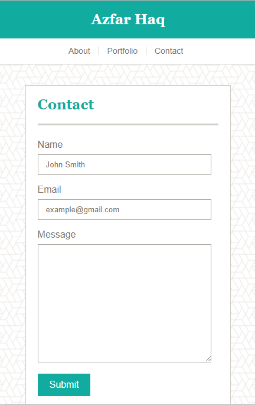
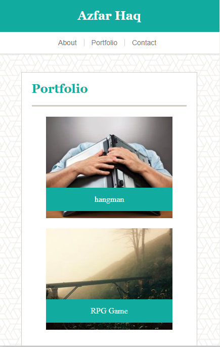

# Responsive-Portfolio
Learn to make a website mobile responsive.

# Link to Deployed Site
[Basic-Portfolio](https://aehaq.github.io/Responsive-Portfolio)

# Images




# Technology Used
- html
- CSS

# Code Snippets
```
@media only screen and (max-width: 640px) {

    ...

    .banner {
        position: relative;
    }

    .footer {
        position: relative;
    }

    .banner-content {
        min-width: 0;
    }

    .name {
        float: none;
        text-align: center;
        margin: 0px;
    }

    .page-links {
        float: none;
        margin-left: auto;
        margin-right: auto;
        margin: 0px auto 0px auto;
        height: 43px;
        width: 230px;
        align-content: center;
    }
    ...
```

# Learning Points
- Using Media Queries to create optimal layouts for desktop, tablet, and smartphone views.
- In order to get rid of the snapping effect when reaching breakpoints, using margin on responsive elements (such as body or invisible wrappers) to set an additional minimum margin.
- Using percentage widths instead of set widths to make responsive styling simpler and more intuitive.
- Creating Headers and Footers that act differently based off of the current view.

# Author 
Azfar Haq - [GitHub](https://github.com/aehaq)

# License
Standard MIT License
